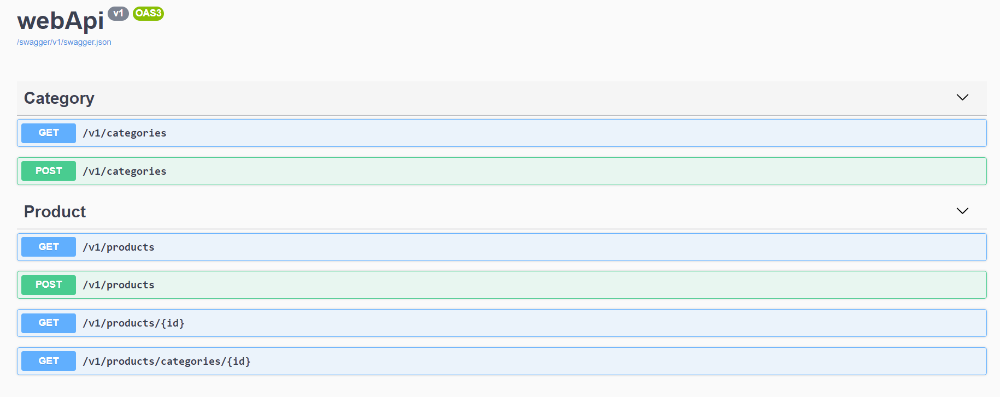

## package needs
```
    Microsoft.EntityFrameworkCore.InMemory
```

### Install

```
    dotnet add package Microsoft.EntityFrameworkCore.InMemory 
````

##iniciar docker
```
docker-compose -f docker-compose.local.yml -f docker-compose-override.yml up -d

```

## test api
```
 http://localhost:5000/swagger/index.html 
```
